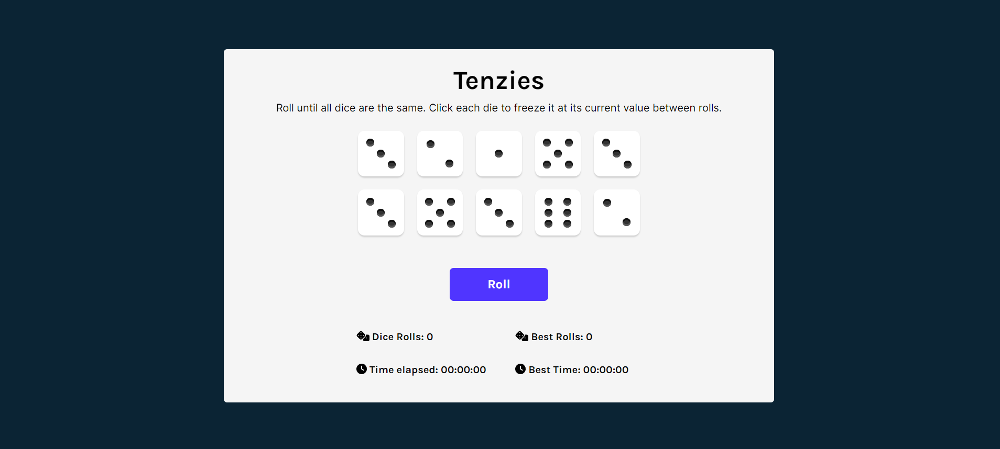
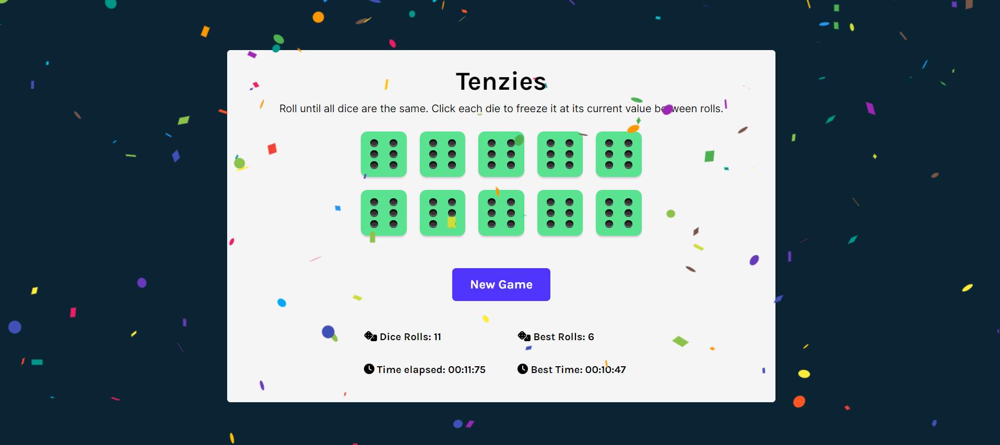

# Tenzies Game 
Tenzies Game is a React-based dice game that challenges players to match 10 die faces in the shortest time with minimal rolls.
This project provides a solution to the [Tenzies Game project on Scrimba](https://scrimba.com/learn/learnreact) following the design provided on this [Figma file](https://www.figma.com/file/FqsxRUhAaXM4ezddQK0CdR/Untitled?node-id=0%3A1). Scrimba helps you improve your coding skills by building realistic projects. 

## Table of contents

- [Overview](#overview)
  - [The challenge](#the-challenge)
  - [Screenshot](#screenshot)
  - [Features added](#features-added)
- [Getting Started with Create React App](#getting-started-with-create-react-app)
    
## Overview

### The challenge

Create a Tenzies Game using the React.JS framework and its functionalities.

### Screenshot

### Features Added

- Put real dots on the dice
- Track the number of rolls
- Track the time it took to win
- Save the user's best rolls and best time to localStorage

## Getting Started with Create React App

This project was bootstrapped with [Create React App](https://github.com/facebook/create-react-app).

### Available Scripts

In the project directory, you can run:

### `npm start`

Runs the app in the development mode.\
Open [http://localhost:3000](http://localhost:3000) to view it in your browser.

The page will reload when you make changes.\
You may also see any lint errors in the console.

### `npm run build`
Builds the app for production to the build folder.
It correctly bundles React in production mode and optimizes the build for the best performance.

The build is minified and the filenames include the hashes.
Your app is ready to be deployed!

See the section about deployment for more information.